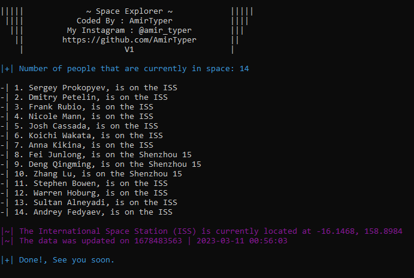

# Space-Explorer
This is a simple Python script that retrieves data from two APIs, and displays the current number of people in space and their names, as well as the current location of the International Space Station (ISS). The script is well-commented, and uses the colorama and termcolor libraries to make the output more visually appealing.

 

 

# Dependencies
* Requests
* colorama
* termcolor

# Notes

* This script requires an active internet connection to fetch the data from the APIs. If there is no internet connection, the script will not work.

* The script automatically clears the terminal window for a cleaner output.
* This is a basic implementation, and it can be expanded to add more functionalities or data sources.
* Enjoy! and let me know what would you like to see in the future version of this project.

# Usage
<pre><code>git clone https://github.com/AmirTyper/Space-Explorer
cd Space-Explorer
pip install -r requirements.txt
python space.py
</code></pre>

# Support me
The easiest way to support me is to click on the star (<g-emoji class="g-emoji" alias="star" fallback-src="https://github.githubassets.com/images/icons/emoji/unicode/2b50.png">⭐</g-emoji>) at the top of <a href="https://github.com/AmirTyper/Space-Explorer">GitHub page</a>.

# Contact me
<pre><code>Developer's Telegram: <a href="https://t.me/Mr_Amir_Typer">click</a>
Developer's Instagram: <a href="https://instagram.com/amir_typer">click</a>
Developer's Twitter: <a href="https://twitter.com/AmirTyper">click</a>
My Website: <a href="https://amirtyper.ir">amirtyper.ir</a>
</code></pre>
